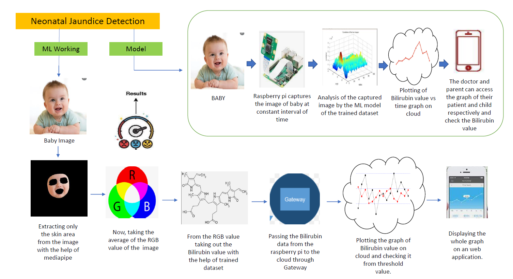
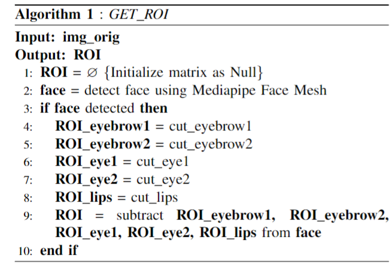
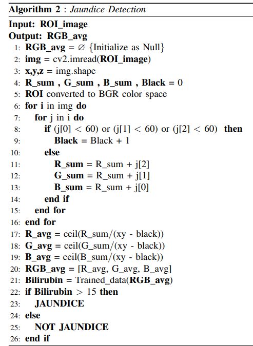
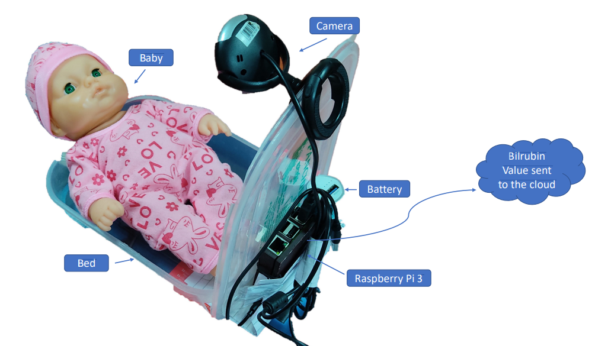
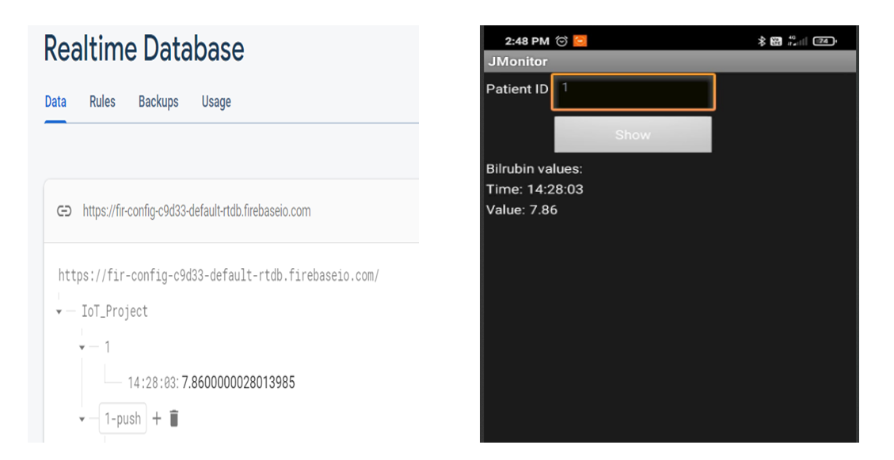
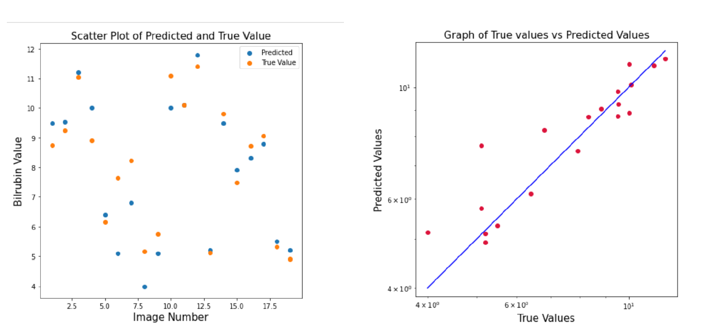

# Neonatal-Jaundice-Detection-System
A machine Learning Project specifically made for the neonates(new-born babies) to detect the jaundice by predicting the bilirubin value using ML model.

## Introduction
Neonatal Jaundice or Hyperbilirubinemia is a prevalent condition that causes yellow discoloration of a new-borns,
in the first few weeks. The leading cause of jaundice is the
high level of the bilirubin substance in the blood.

A blood
test for Total Serum Bilirubin (TSB) is used to recognize
new-borns at high risk of developing bilirubin encephalopathy.
However, significant drawbacks include high costs, time taking,
invasive techniques,
using additional equipment etc.

We have made a project that 
addresses these problems in the form of RGB (Red Green
Blue) colour-based technique. This approach uses a camera
connected with Raspberry Pi where we continuously monitor the
condition of the baby and check its Bilirubin value in definite
time interval. The whole system quantifies the bilirubin value
based on the region of interest, i.e., only face skin area, of which
RGB value is taken out using a Machine Learning Model. Jaundice is diagnosed if the predicted
bilirubin level is > 15 mg dL−1 for the new-born babies.

## Conceptual Diagram

## Methodology
#### Extracting ROI from face i.e only skin part
* First of all we used Mediapipe library to get the 468 coordinates of the face known as facial landmarks.
* After that we used convex hull and coordinates of eyes,ears,mouth and eyebrows to cut them out from the face using opencv.
* The part that is left becomes our ROI and we send them to opencv to calculate the Avg RGB values of the skin.

#### Training our machine learning model on real life dataset
* For Data Collection we collected the dataset i.e photos of new born babies along with their bilirubin values from AIIMS.
* After That we trained our **Suport Vector Machine** machine learning model on this processed dataset.

#### Predicting the bilrubin value and classifying it as Jaundice or not.
* The RGB values we obtained from the first part are send to the trained model
* The model predicts the bilrubin value and send them over the cloud i.e to firebase.

#### Accessing The predicted bilirubin values of a particular baby using the android app.
* We developed an android app so that the doctor or family can see the bilirubin values time to time.
* This app is linked with real time cloud based database i.e firebase.

## Algorithms
#### Algorithm -1

#### Algorithm -2

## Demonstration

##### **App ScreenShot**

## Analysis of our Model
##### **Scatterplot of true and predicted values**

#### **Remarks**

Our model acheived an **accuracy of 85%** on the test data and we are trying to increase that accuracy by increasing our dataset as currently our dataset is less. 
